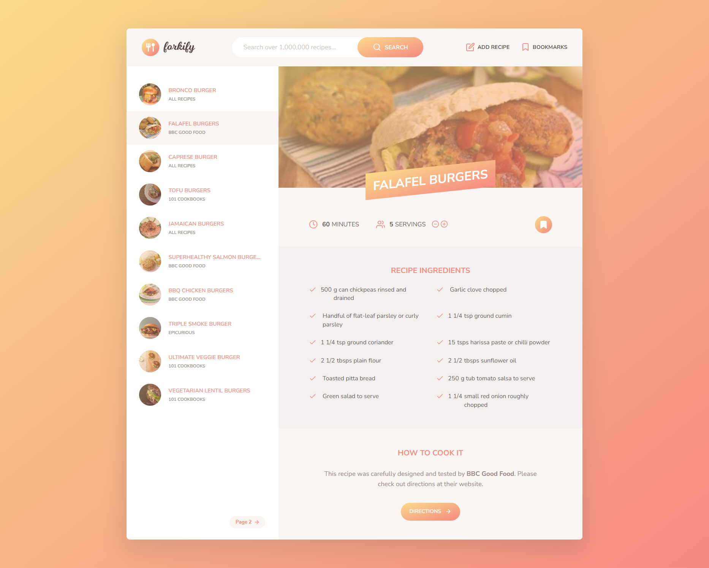

# Forkify Project - Udemy JavaScript Course



## Description

This repository contains the Mapty project developed as part of [The Complete JavaScript Course 2024: From Zero to Expert!](https://www.udemy.com/course/the-complete-javascript-course/) course on Udemy. Forkify is a sophisticated web application that empowers users to discover, save, and organize recipes from various sources across the web.

## Key Features

- **Recipe Search**: Utilize powerful search functionality to find recipes based on keywords, ingredients, or dietary preferences.
- **Recipe Details**: Dive deep into each recipe with comprehensive information including ingredients, preparation steps, and nutritional facts.
- **Favorite Recipes**: Easily bookmark and access your favorite recipes for quick reference.
- **Add New Recipe**: Seamlessly add your own recipes to personalize your collection and share with others.

## Technologies Utilized

Forkify leverages cutting-edge technologies to deliver a robust and user-friendly experience:

- **HTML5 and CSS3**: For creating a sleek and visually appealing user interface.
- **JavaScript (ES6+)**: For implementing the application's core logic and interactivity.
- **Webpack**: To bundle and manage the project's numerous JavaScript modules efficiently.

[](https://skills.thijs.gg)

## Getting Started

Follow these steps to set up and run Forkify on your local machine:

1. **Clone the Repository**: Begin by cloning this repository to your local machine using the following command:

   ```sh
   git clone https://github.com/AntonioSertic23/Course-Project-Forkify.git
   ```

2. **Install Dependencies**: Navigate to the cloned repository directory and install project dependencies using NPM:

   ```sh
   npm install
   ```

3. **Enter API Key**: Open the `src/js/config.js` file and replace `'ENTER YOUR API'` with your own API key:

   ```javascript
   const KEY = 'YOUR_API_KEY_HERE';
   ```

4. **Run the Application**: Once the dependencies are installed, start the application by running the following command:

   ```sh
   npm start
   ```

5. **Access Forkify**: Open your web browser and navigate to `http://localhost:1234` to access the Forkify application locally.

## Project Structure

The Forkify project is organized into the following structure:

- `index.html`: The main HTML file serving as the entry point for the application.
- `src/img`: Directory housing images utilized within the application.
- `src/js/controller.js`: Controller module responsible for handling user interactions.
- `src/js/model.js`: Model module managing application data and state.
- `src/js/helpers.js`: Helper functions utilized across the application.
- `src/js/views`: Directory containing modules responsible for rendering views.
- `src/sass`: Directory containing SCSS files for styling the application.

## Credits

The Forkify project was created as part of [The Complete JavaScript Course 2024: From Zero to Expert!](https://www.udemy.com/course/the-complete-javascript-course/) on Udemy, instructed by [Jonas Schmedtmann](https://www.udemy.com/user/jonasschmedtmann/). The design, code, and concepts are based on the course content.
